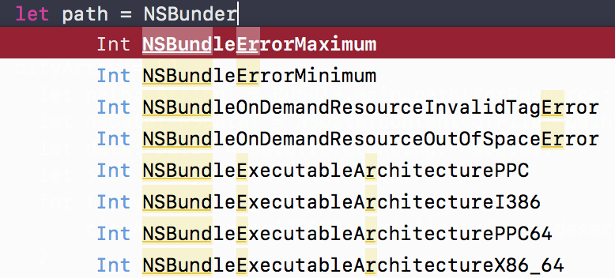
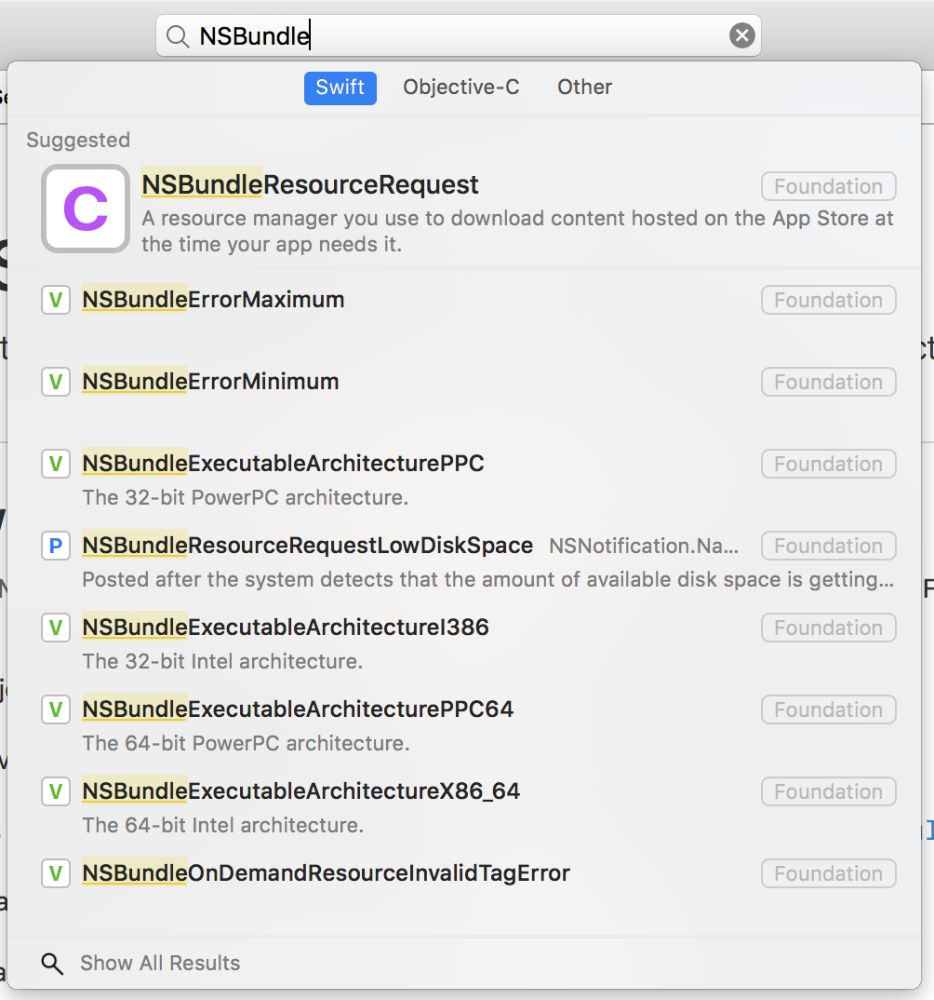
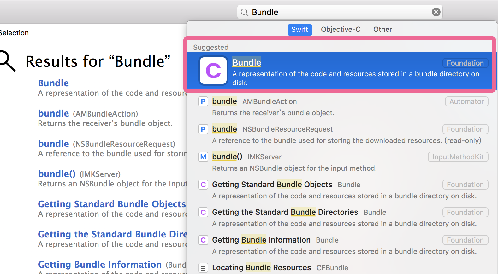
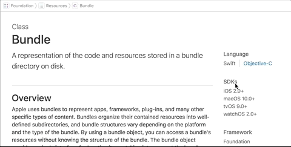

> 记录使用 SwiftyJSON 和 HandyJSON 在 Swift 4 中处理 JSON 文件的过程

最近接了一个项目，这个项目用到了[中央天气预报 API](https://github.com/jokermonn/-Api/blob/master/CenterWeather.md)的接口，这个接口提供了其所用城市码的数据文件，我采用了 JSON 文件来处理数据信息。

## 引

在进行 Swift 的 JSON 文件处理时，我查阅了大量资料，大多数的博客均采用了以下的类来读取 JSON 文件并转换为`Array`

-   `NSBundle`
-   `NSData`
-   `NSJSONSerialization`

## 存在了问题

参考他人博客的处理方式，我在自己的平台上测试时，发现会出现以下的"神秘"异常



嗯，嗯？`NSBundle`呢？？上下翻看发现`NSBundle`并没有出现在匹配列表中。

这个情况我不考虑引入问题，而是考虑 Swift 3 到 Swift 4 的差异，于是我查找了 Xcode 中的 Develop Documentation



哈！果然没有第一个出现，说明这个类现在已经被改成别的名称了（顺势吐槽不是说好的 NS 公司的产物吗居然改名？？）

然后把 NS 去掉，看看结果……



Foundation？？`Bundle`？？右边有个链接查看 Objective-C 的，点一下



绝了，还真是 Swift 和 Objective-C 两个版本不同名的

## 找到问题，出个解法

既然改名叫了`Bundle`，那其他的两个应该也没差了吧，果断写出下面的代码来试试

```swift
// JSON文件名: CityCode.json
let path: String! = Bundle.main.path(forResource: "CityCode", ofType: "json")
let nsData: NSData! = NSData(contentsOfFile: path)
let data: Data! = Data(referencing: nsData!)
let json = try? JSON(data: data)
```

这里为什么不直接用`Data(contentsOf: URL)`，别问为什么，有一个更容易看懂的`NSData(contentsOfFile: String)`和一个`Data(referencing: NSData)`，懒得用`NSURL`了

好吧好吧还是给一个 URL 版的

```swift
let path: String! = Bundle.main.path(forResource: "CityCode", ofType: "json")
let url: URL! = NSURL.fileURL(withPath: path)
let data: Data! = try? Data(contentsOf: url)
let json = try? JSON(data: data)
```

## SwiftyJSON 和 HandyJSON

细心的话你会注意到其中的`JSON(data: data)`和`class City: HandyJSON`

#### `JSON(data: data)`

这是 SwiftyJSON 创建 JSON 对象的方法，使用由`Data`类解析 JSON 文件获得的数据

#### `class City: HandyJSON`

这是使`City`类能够支持 JSON to Model 的方式，通过使用 HandyJSON 框架，为`City`类提供反序列化能力，并通过下面的代码将 JSON 文件转化成`Array`

```swift
cityArray.append(JSONDeserializer<City>.deserializeFrom(json: value.rawString())!)
```

## 应用范例

这里给出中央天气接口城市数据的 JSON 部分内容，以及我个人封装的城市对象 Model，和完整的 CityUtils 代码

#### CityCode.json

```json
[
    {
        "ID": "1",
        "cityName": "北京",
        "cityEN": "Beijing",
        "townID": "CHBJ000000",
        "townName": "北京",
        "townEN": "Beijing"
    },
    {
        "ID": "2",
        "cityName": "北京",
        "cityEN": "Beijing",
        "townID": "CHBJ000100",
        "townName": "海淀",
        "townEN": "Haidian"
    }
]
```

#### Weather.swift

```swift
/// 天气API的基础类, 继承HandyJSON
class City: HandyJSON {

    var ID: String
    var cityName: String
    var cityEN: String
    var townID: String
    var townName: String
    var townEN: String

    required convenience init() {
        self.init(ID: "", cityName: "", cityEN: "", townID: "", townName: "", townEN: "")
    }

    init(ID: String, cityName: String, cityEN: String, townID: String, townName: String, townEN: String) {
        self.ID = ID
        self.cityName = cityName
        self.cityEN = cityEN
        self.townID = townID
        self.townName = townName
        self.townEN = townEN
    }

    var description: String {
        return self.toJSONString() ?? "[]"
    }

}

/// 城市工具类
///
/// 城市信息通过CityCode.json获取
class CityUtils {

    /// 城市工具的单例
    static let instance = CityUtils()

    /// 从JSON数据库文件获取的城市列表
    private var cityArray: [City]

    /// 访问城市列表
    var cities: [City] {
        return cityArray
    }

    /// 私有的初始化方法
    private init() {
        cityArray = []
        // NSData style
        // let path: String! = Bundle.main.path(forResource: "CityCode", ofType: "json")
        // let nsData: NSData! = NSData(contentsOfFile: path)
        // let data: Data! = Data(referencing: nsData!)
        // let json = try? JSON(data: data)

        // URL style
        let path: String! = Bundle.main.path(forResource: "CityCode", ofType: "json")
        let url: URL! = NSURL.fileURL(withPath: path)
        let data: Data! = try? Data(contentsOf: url)
        let json = try? JSON(data: data)
        for (_, value) in json! {
            cityArray.append(JSONDeserializer<City>.deserializeFrom(json: value.rawString())!)
        }
    }

    /// 通过ID取得单个城市对象
    func get(byID id: String) -> City? {
        for city in cityArray {
            if city.ID == id {
                return city
            }
        }
        return nil
    }

    /// 通过区域ID获取单个城市对象, 另外区域ID可以直接用于请求API
    func get(byTownID townID: String) -> City? {
        for city in cityArray {
            if city.townID == townID {
                return city
            }
        }
        return nil
    }

    /// 通过城市名称获取该城市下的区域列表
    func list(byCityName cityName: String) -> [City] {
        var list: [City] = []
        for city in cityArray {
            if city.cityName == cityName {
                list.append(city)
            }
        }
        return list
    }

    /// 通过城市英文名称获取该城市下的区域列表
    func list(byCityEN cityEN: String) -> [City] {
        var list: [City] = []
        for city in cityArray {
            if city.cityEN == cityEN {
                list.append(city)
            }
        }
        return list
    }

}
```
