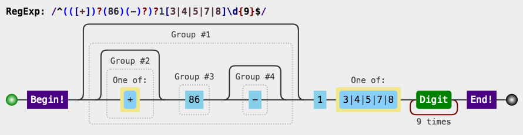
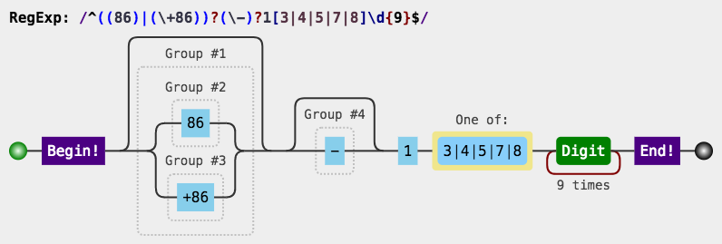
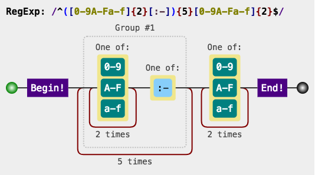
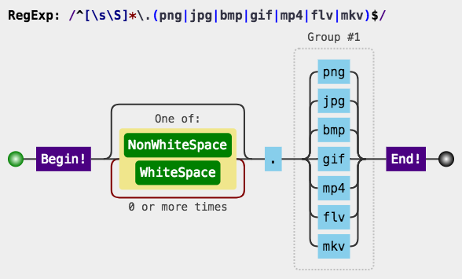

> 这篇博文，旨在记录一些我个人开发时使用过的一些正则表达式  
> 我会给出几种格式来方便各位使用

> 更新时间：2018-02-26

## 手机号码

### 第一种

-   Javascript

```javascript
var regex = /^(([+])?(86)(-)?)?1[3|4|5|7|8]\d{9}$/
```

-   Groovy

```groovy
def regex = /(([+])?(86)(-)?)?1[3|4|5|7|8]\d{9}/
```

-   Java

```java
String regex = "(([+])?(86)(-)?)?1[3|4|5|7|8]\\d{9}";
```



### 第二种

-   Javascript

```javascript
var regex = /^((86)|(\+86))?(\-)?1[3|4|5|7|8]\d{9}$/
```

-   Groovy

```groovy
def regex = /((86)|(\+86))?(\-)?1[3|4|5|7|8]\d{9}/
```

-   Java

```java
String regex = "((86)|(\\+86))?(\\-)?1[3|4|5|7|8]\\d{9}";
```



## MAC 地址

-   Javascript

```javascript
var regex = /^([A-Fa-f0-9]{2}[:-]){5}[A-Fa-f0-9]{2}$/
```

-   Groovy

```groovy
def regex = /([A-Fa-f0-9]{2}[:-]){5}[A-Fa-f0-9]{2}/
```

-   Java

```java
String regex = "([A-Fa-f0-9]{2}[:-]){5}[A-Fa-f0-9]{2}";
```



## 密码强度

密码需要满足：

-   至少一个大写字母
-   至少一个小写字母
-   至少一个数字
-   至少一个特殊符号，支持`-_,.:;!?@#$%^&*+=~/|()<>{}[]\"'`

```regexp
^(?=.*?[A-Z])(?=.*?[a-z])(?=.*?[0-9])(?=.*?[-_,.:;!?@#$%^&*+=~/|()<>{}[\]\\"']).{8,}$
```

## URL 的域名解析

```regexp
^(http[s]?):\/\/([a-zA-Z0-9][-a-zA-Z0-9]{0,62}\.)?(([a-zA-z0-9][-a-zA-z0-9]{0,62})((\.[a-zA-Z]{2,3})+))(:[0-9]{1,5})?[-a-zA-Z0-9()@:%_\\\+\.~#?&\/=]*$
```

## 媒体文件后缀判断

允许添加任意想要支持的格式在该正则判断中

-   Javascript

```javascript
var regex = /^[\s\S]*\.(png|jpg|bmp|gif|mp4|flv|mkv)$/
```

-   Groovy

```groovy
def regex = /[\s\S]*\.(png|jpg|bmp|gif|mp4|flv|mkv)/
```

-   Java

```java
String regex = "[\\s\\S]*\\.(png|jpg|bmp|gif|mp4|flv|mkv)";
```



## Python logging in Ideolog plugin

这里假定有如下的 logging 输出格式

```yaml
formatters:
    default_format:
        format: "%(asctime)s [%(name)s] [%(levelname)s] %(message)s"
        datefmt: "%Y-%m-%d %H:%M:%S"
```

用来匹配这个格式的日志的正则

```regexp
^(\d{4}-\d{2}-\d{2}\s\d{2}:\d{2}:\d{2})\s\[(.*)]\s\[(.*)]\s(.*)$
```

日志开头的正则

```regexp
^\d
```

时间格式

```text
yyyy-MM-dd HH:mm:ss
```

其他配置

```yaml
Time capture group: 1
Severity capture group: 3
Category capture group: 2
```
